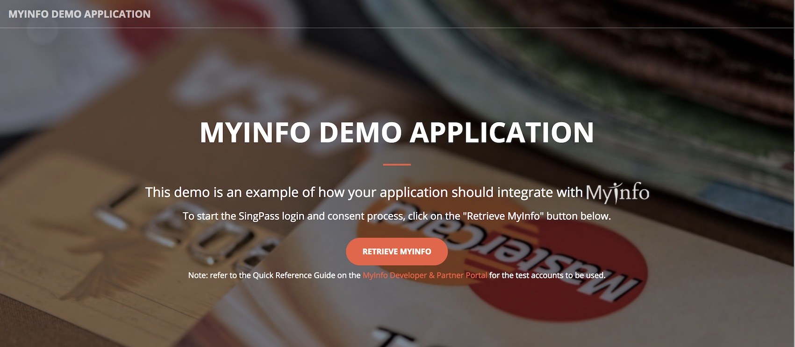

# MyInfo Tutorial App Setup

### Install Nodejs and npm

If you've yet to install Nodejs or npm, please use this [link](https://nodejs.org/en/download/)

If you have both Nodejs installed, please ensure Nodejs version is at least v6. Check using `node -v` command.

### Install Tutorial App dependencies
Access the downloaded tutorial material and navigate to myinfo-tutorial-app, then run the following command:
```
npm install
```

### Import Tutorial App to IDE
Import myinfo-tutorial-app folder to IDE of choice

### Start Tutorial App
For Linux/MacOS
Execute the following command to start the application:
```
./start.sh
```

For Windows
Execute the following command to start the application:
```
start.bat
```

### Access Tutorial App Landing Page
Access the following URL `http://localhost:3001` from your browser



If you can see the page above, it means your setup is complete and you are ready for the tutorial!

>Please note that this is a blank tutorial app, you have to follow the tutorial to see the expected results.    
>Please contact the facilitators if you are having difficulties with the setup.


# TUTORIAL 1

### Step 1: Invoke the Sandbox Person API

Copy the URL below.

`https://myinfo.api.gov.sg/dev/L0/v1/person/S9203266C/`


`S9203266C` is the UINFIN (NRIC or FIN) parameter of the person.

Try to invoke the API again by using the following UINFIN :

* F9477325W
* S5062854Z
* T0066846F


MyInfo API Specs : [MyInfo Developer & Partner Portal](https://myinfo-api.app.gov.sg)

# TUTORIAL 2


## Getting Started
1. Open cmd or terminal
2. Change your directory to myinfo-tutorial-app root folder
3. Run "npm install" (If you have not done so)

### Step 1: Function for calling Authorise API (Enable "RETRIEVE MYINFO" Button)
Paste below codes to: `views/html/index.html` - `t2step1`

```javascript
var authoriseUrl = authApiUrl +
  "?client_id=" + clientId +
  "&attributes=" + attributes +
  "&purpose=" + purpose +
  "&state=" + state +
  "&redirect_uri=" + redirectUrl;

window.location = authoriseUrl;
```

Save and restart app.
Click on "RETRIEVE MYINFO" button and login to SingPass using the credentials below.

#### Login Credentials
>UINFIN: S9812381D  
>Password: MyInfo2o15

### Step 2: Call the Token API (with the authorisation code)
Paste below codes to: `routes/index.js` - `t2step2`

```javascript
request = createTokenRequest(code);
request
  .buffer(true)
  .end(function(callErr, callRes) {
    if (callErr) {
      // ERROR
      console.log("Error from Token API:".red);
      console.log(callErr.status);
      console.log(callErr.response.req.res.text);
      res.jsonp({
        status: "ERROR",
        msg: callErr
      });
    } else {
      // SUCCESSFUL
      var data = {
        body: callRes.body,
        text: callRes.text
      };
      console.log("Response from Token API:".green);
      console.log(JSON.stringify(data.body));

      var accessToken = data.body.access_token;
      if (accessToken == undefined || accessToken == null) {
        res.jsonp({
          status: "ERROR",
          msg: "ACCESS TOKEN NOT FOUND"
        });
      }

      // everything ok, call person API
      callPersonAPI(accessToken, res);
    }
  });
```

### Step 3: function to prepare request for TOKEN API
Paste below codes to: `routes/index.js` - `t2step3`

```javascript
// assemble params for Token API
var strParams = "grant_type=authorization_code" +
  "&code=" + code +
  "&redirect_uri=" + _redirectUrl +
  "&client_id=" + _clientId +
  "&client_secret=" + _clientSecret;
var params = querystring.parse(strParams);


// assemble headers for Token API
var strHeaders = "Content-Type=" + contentType + "&Cache-Control=" + cacheCtl;
var headers = querystring.parse(strHeaders);

// Sign request and add Authorization Headers
// t3step2a PASTE CODE BELOW

// t3step2a END PASTE CODE


console.log("Request Header for Token API:".green);
console.log(JSON.stringify(headers));

var request = restClient.post(_tokenApiUrl);

// Set headers
if (!_.isUndefined(headers) && !_.isEmpty(headers))
  request.set(headers);

// Set Params
if (!_.isUndefined(params) && !_.isEmpty(params))
  request.send(params);
```

Save and restart app.

#### Login Credentials
>UINFIN: S9812381D  
>Password: MyInfo2o15

### Step 4: validate and decode token to get UINFIN
Paste below codes to: `routes/index.js` - `t2step4`

```javascript
var decoded = securityHelper.verifyJWS(accessToken, _publicCertContent);
if (decoded == undefined || decoded == null) {
  res.jsonp({
    status: "ERROR",
    msg: "INVALID TOKEN"
  })
}

console.log("Decoded Access Token:".green);
console.log(JSON.stringify(decoded));

var uinfin = decoded.sub;
if (uinfin == undefined || uinfin == null) {
  res.jsonp({
    status: "ERROR",
    msg: "UINFIN NOT FOUND"
  });
}
```

Save and restart app.

#### Login Credentials
>UINFIN: S9812381D  
>Password: MyInfo2o15

### Step 5: Call Person API using accessToken
Paste below codes to: `routes/index.js` - `t2step5`

```javascript
var request = createPersonRequest(uinfin, accessToken);

// Invoke asynchronous call
request
  .buffer(true)
  .end(function(callErr, callRes) {
    if (callErr) {
      console.log("Error from Person API:".red);
      console.log(callErr.status);
      console.log(callErr.response.req.res.text);
      res.jsonp({
        status: "ERROR",
        msg: callErr
      });
    } else {
      // SUCCESSFUL
      var data = {
        body: callRes.body,
        text: callRes.text
      };

      var personData = data.text;
      if (personData == undefined || personData == null) {
        res.jsonp({
          status: "ERROR",
          msg: "PERSON DATA NOT FOUND"
        });
      }
      else {
        if (_authLevel == "L0") {
          personData = JSON.parse(personData);
          personData.uinfin = uinfin; // add the uinfin into the data to display on screen

          console.log("Person Data :".green);
          console.log(JSON.stringify(personData));
          // successful. return data back to frontend
          res.jsonp({
            status: "OK",
            text: personData
          });

        }
        else if(_authLevel == "L2"){
          console.log("Response from Person API:".green);
          console.log(personData);
          //t3step3 PASTE CODE BELOW

          //t3step3 END PASTE CODE
        }
        else {
          throw new Error("Unknown Auth Level");
        }
      } // end else
    }
  }); // end asynchronous call
```

### Step 6: function to prepare request for PERSON API
Paste below codes to: `routes/index.js` - `t2step6`

```javascript
var strParams = "client_id=" + _clientId +
  "&attributes=" + _attributes;
var params = querystring.parse(strParams);

// assemble headers for Person API
var strHeaders = "Cache-Control=" + cacheCtl;
var headers = querystring.parse(strHeaders);
var authHeaders;
// Sign request and add Authorization Headers
// t3step2b PASTE CODE BELOW

// t3step2b END PASTE CODE
if (!_.isEmpty(authHeaders)) {
  _.set(headers, "Authorization", authHeaders + ",Bearer " + validToken);
}
else {
  // NOTE: include access token in Authorization header as "Bearer " (with space behind)
    _.set(headers, "Authorization", "Bearer " + validToken);
}

console.log("Request Header for Person API:".green);
console.log(JSON.stringify(headers));

// invoke token API
var request = restClient.get(url);

// Set headers
if (!_.isUndefined(headers) && !_.isEmpty(headers))
  request.set(headers);

// Set Params
if (!_.isUndefined(params) && !_.isEmpty(params))
  request.query(params);
```

Save and restart app.

#### Login Credentials
>UINFIN: S9812381D  
>Password: MyInfo2o15

### Step 7: function to fill the form with person data
Paste below codes to: `views/html/index.html` - `t2step7`

```javascript
var formValues = {
  "uinfin": data.uinfin,
  "name": data.name.value,
  "sex": data.sex.value,
  "race": data.race.value,
  "nationality": data.nationality.value,
  "dob": data.dob.value,
  "email": data.email.value,
  "mobileno": toStr(data.mobileno, 'PHONENUMLOCAL'),
  "regadd": toStr(data.regadd, 'ADDRESSLOCAL'),
  "housingtype": toStr(data, 'HOUSINGTYPE'),
  "marital": data.marital.value,
  "edulevel": data.edulevel.value,
};
```

Save and restart app.

#### Login Credentials
>UINFIN: S9812381D  
>Password: MyInfo2o15

#### Congratulations! You have completed tutorial 2, which shows you the OAUTH 2.0 flow. You are now able to retrieve the data and populate into the form.

# TUTORIAL 3

### Step 1: Switching to Secured APIs

1. open config file
a. Linux/Mac OS - `start.sh`  
b. Windows - `start.bat`
2. Uncomment L2 APIs
3. Comment L0 APIs
4. Save, close and Save and restart app.

#### Login Credentials
>UINFIN: S9812381D  
>Password: MyInfo2o15

### Step 2: Signing Token & Person request

##### a) Signing the Token Request

Paste below codes to: `routes/index.js` - `t3step2a`

```javascript
var authHeaders = securityHelper.generateAuthorizationHeader(
  _tokenApiUrl,
  params,
  method,
  contentType,
  _authLevel,
  _clientId,
  _privateKeyContent,
  _clientSecret,
  _realm
);

if (!_.isEmpty(authHeaders)) {
  _.set(headers, "Authorization", authHeaders);
}
```
###### b) Signing the Person Request
Paste below codes to: `routes/index.js` - `t3step2b`

```javascript
authHeaders = securityHelper.generateAuthorizationHeader(
  url,
  params,
  method,
  "", // no content type needed for GET
  _authLevel,
  _clientId,
  _privateKeyContent,
  _clientSecret,
  _realm
);
```

Save and restart app.

#### Login Credentials
>UINFIN: S9812381D  
>Password: MyInfo2o15


### Step 3: Decrypting JWE Response

Paste below codes to: routes/index.js - t3step3

```javascript
// header.encryptedKey.iv.ciphertext.tag
var jweParts = personData.split(".");

securityHelper.decryptJWE(jweParts[0], jweParts[1], jweParts[2], jweParts[3], jweParts[4], _privateKeyContent)
  .then(personData => {
    if (personData == undefined || personData == null)
      res.jsonp({
        status: "ERROR",
        msg: "INVALID DATA OR SIGNATURE FOR PERSON DATA"
      });
    personData.uinfin = uinfin; // add the uinfin into the data to display on screen

    console.log("Person Data (Decoded/Decrypted):".green);
    console.log(JSON.stringify(personData));
    // successful. return data back to frontend
    res.jsonp({
      status: "OK",
      text: personData
    });
  })
  .catch(error => {
    console.error("Error with decrypting JWE: %s".red, error);
  })
  ```

  Save and restart app.

  #### Login Credentials
  >UINFIN: S9812381D  
  >Password: MyInfo2o15

#### Congratulations! You have completed tutorial 3, which is about securing the APIs. You are now able to sign your requests and decrypt the response.
